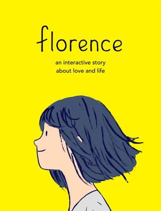
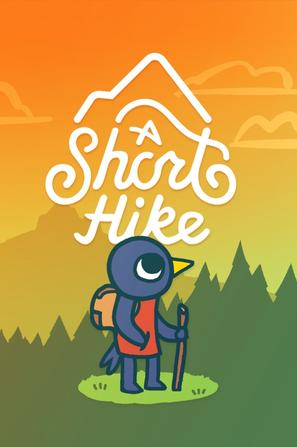
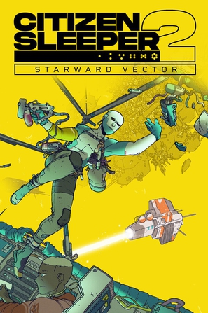
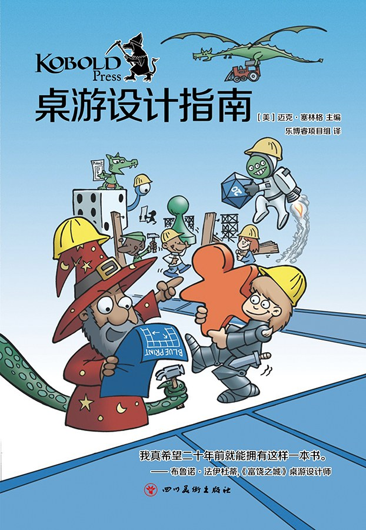
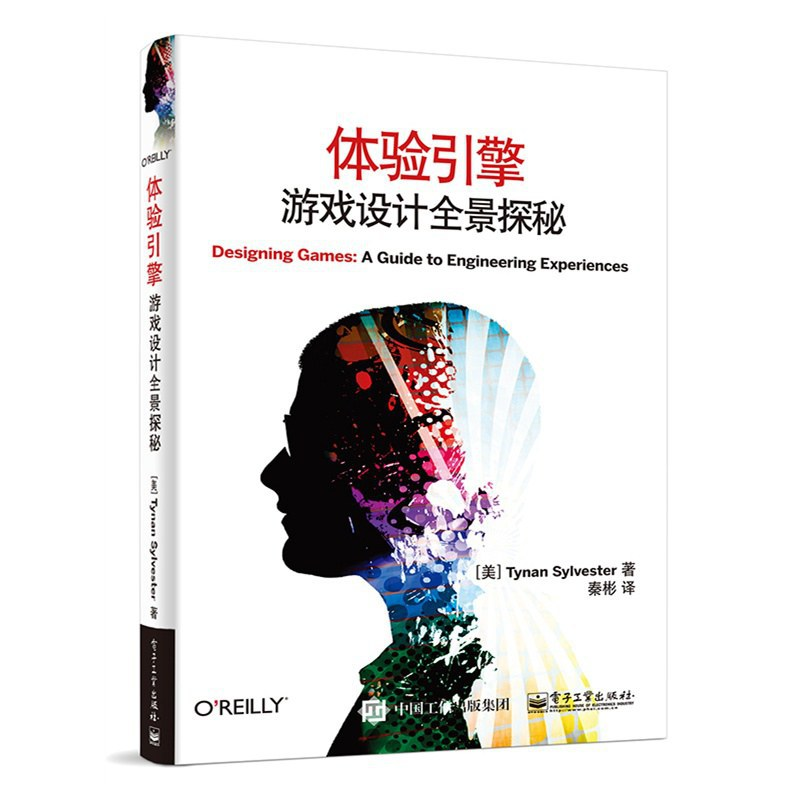
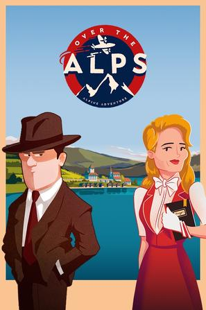
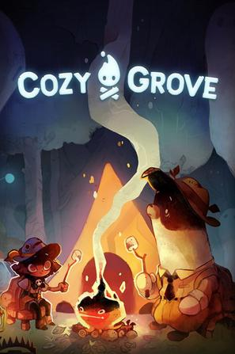
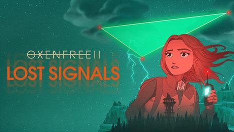

作为一个从业者，常常被屁股左右脑袋，被金钱和工作压力不自觉地影响自己的观点。我想提醒自己，要自由地思考，在这个列表里抛开一切，只有一个标准，你只需要问你自己——你有没有感动，被拥抱的那种感动。

过去我玩过很多游戏, 有些是为了从现实中逃避出来, 大多数是和朋友们一块儿找个事儿做. 当我离开我的朋友们的时候, 那些我都不愿意再玩了。那么丢弃了那些游戏之后, 还剩下什么你喜欢的, 能完整玩下来的.

以我对自己的了解, 我是一个讲故事的人, 游戏是一种讲故事的方式. 不过在做游戏的时候, 也会很容易用一些条条框框去限制自己, 比如说我过去做过一些叙事游戏，那么我就会想, 我就适合这些, 而不适合另外一些类型, 根据我对自己的看法, 根据我对过去经历总结出的经验我会形成一套成见, 它帮助我集中精神, 也限制我的视野。但是我想如果你真的被某个东西打动了, 你感受得到它的美, 那么真实的感受应该要超越被总结出的经验, 它应当被接纳, 成为新的规则。也就是说，感受汇聚成经验，在某些时候要相信自己的感受，要超越经验，当然更要超越外界的权威和知识。

Frostpunk是8-10小时, 有一个吸引人的故事的
A Short Hike是2-3小时, 拥有一个轻松的氛围, 简单的机制, 在中午玩儿完的甜品
Dredge是8-10小时, 让我一直好奇后面还有什么神秘的东西的
这些我都很喜欢

>关键词：叙事驱动，casual氛围，体验引擎，人文,策略选择,经营计算,生活,新颖.
>
>负面关键词：非战斗,非反应,非计算, 非高度重复-

------

1. 弗洛伦斯 Florence 

2. 冰汽时代 Frostpunk 

    > 充满紧张，但是又触动人心

3. 短途旅行 A Short Hike 

4. 渔帆暗涌 DREDGE 

    > 探索，任务

5. 深空梦里人2 Citizen Sleeper 2: Starward Vector 

6. 孤星寂海 In Other Waters 

    > 好玩, 不是那种强烈牵引着你, 让你心跳加速欲罢不能的东西. 它安静, 和谐, 优雅, 引人深入, 让人回味. 我以为它会把流程做长, 我看着那个47%的进度, 已经有些厌烦的时候它正好结束了, 很好, 不多也不少。

7. 桌游设计指南 

    > 是本书，是我读过最有用的书，其他书里讲到的丰富的细节后来我都忘了，这本书我却常常想起来。

8. 体验引擎 

9. 越过阿尔卑斯山 Over the Alps 

    > 精致的互动绘本, 文本的互动性很强, 给我的代入感最强的文字互动. 虽然玩第二个故事会觉得有点无聊(其实第二个更加抓人, 更戏剧化)

10. 孤山速降 Lonely Mountains: Downhill 

    > 喜欢他的探索，casual感，一点技巧，不喜欢挑战。我更希望他能变成短途旅行那样的，一勺旅伴，一滴趣味，一锅故事。

11. 肯塔基零号国道 Kentucky Route Zero 

    > 并不是特别喜爱的游戏，但是它和roki，oxenfree一起，让我看到游戏的边界
    >
    > 有些游戏需要你坐下来，安静下来和他交流。

12. 洛基：北欧怪奇之旅 Röki 

    > 怪兽aho！

13. 舒林 Cozy Grove 

    > 系统简单流畅的生活模拟, 我喜欢他的系统流畅和谐, 不喜欢它的重复.
    > 如果是多人就好了, 或者如果是一段简单的旅途就好了.

14. 奥森弗里2：信号丢失 OXENFREE II: Lost Signals 

    > 我以为我不喜欢他, 但我常常想起它, 它在构筑游戏世界时候的那些谈话, 那些闲言碎语
