豆瓣的书单只能收书。这个列表里顶部写到的一些东西，比如 iPhone 6、smartisan T2、vscode、chatgpt，其实也都应该算进去，所以这里把它补成一份完整列表。

1. iPhone 6 
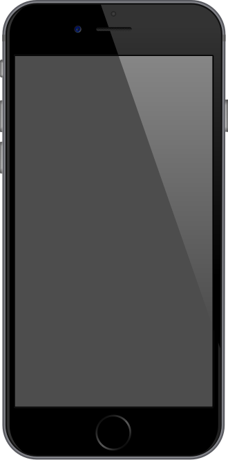

2. smartisan T2 
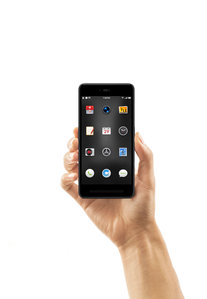

3. apple 
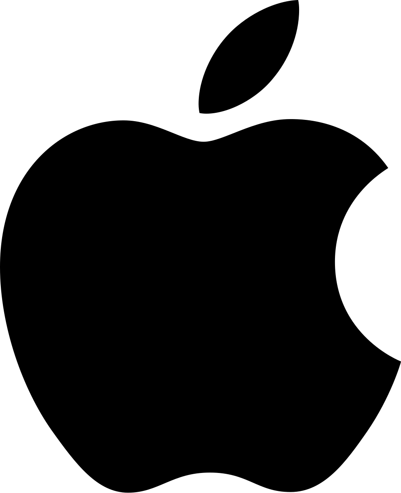

4. smartisan 
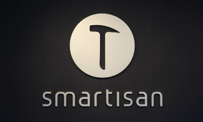

5. vscode 

6. chatgpt 
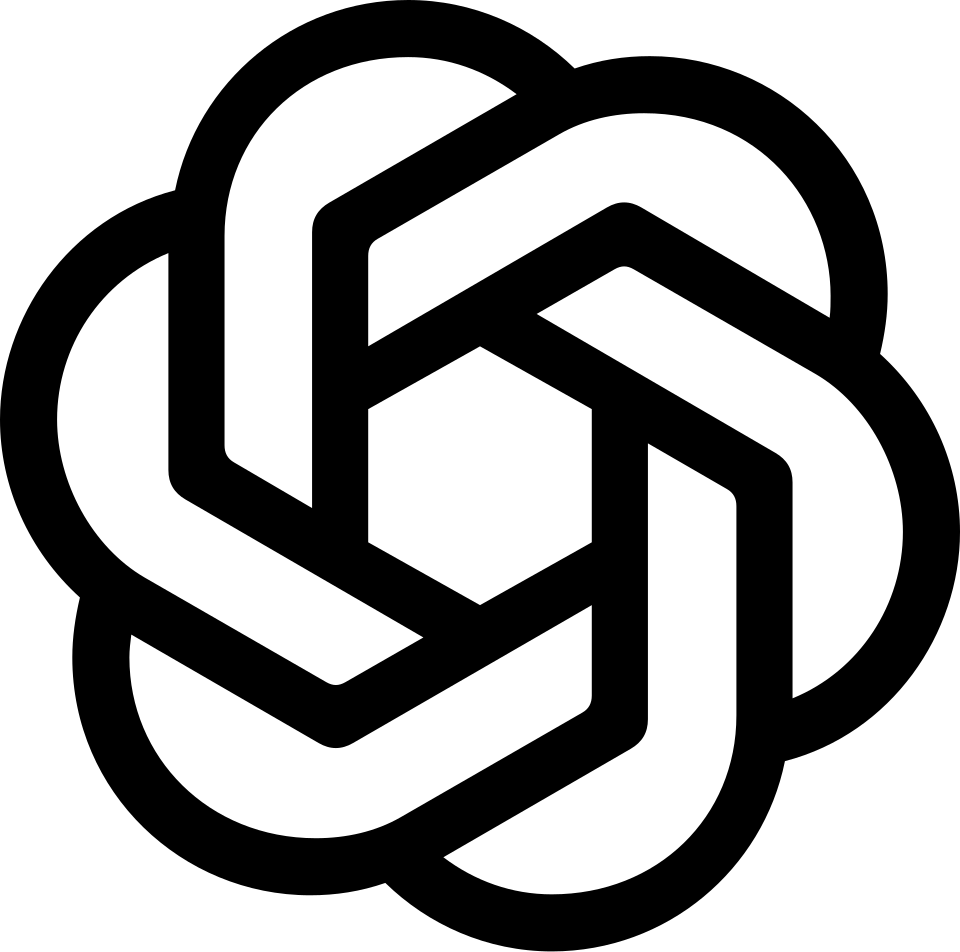

7. valve 
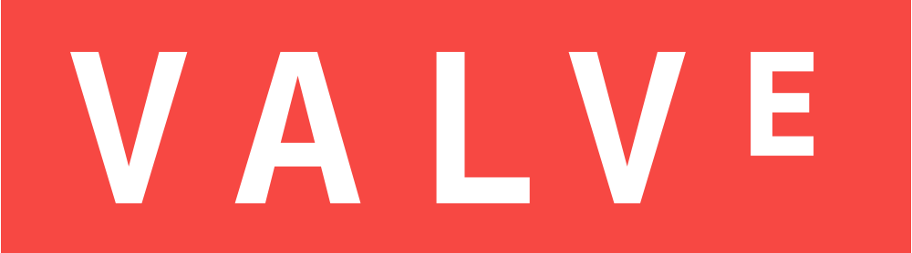

8. klei 
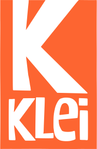

9. rimworld 
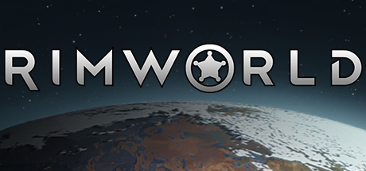

10. C程序设计语言 
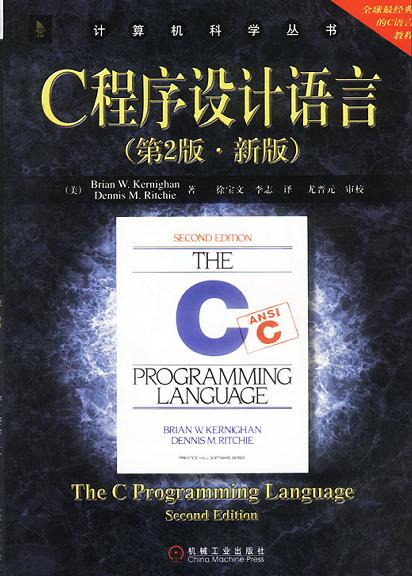

11. The Little Schemer 
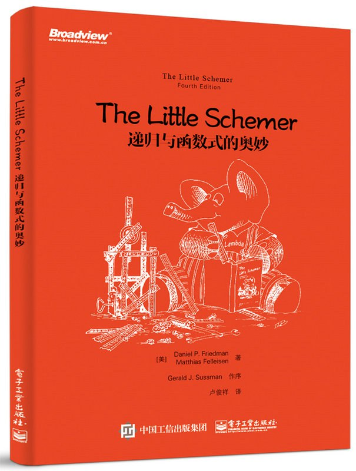

12. 禅与摩托车维修艺术 
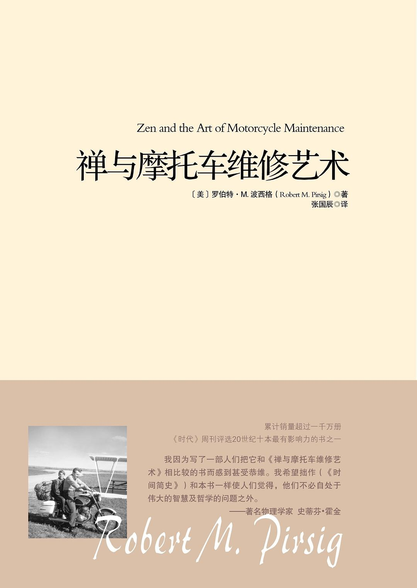

13. 黑客与画家 
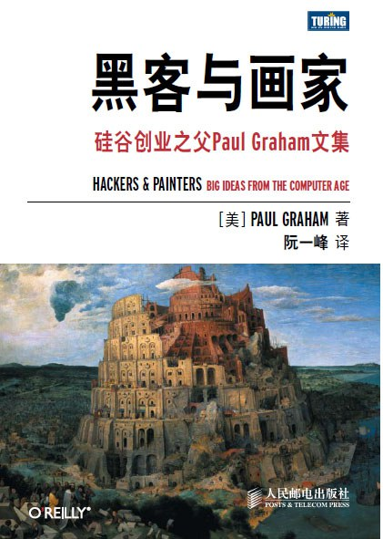

14. 计算机程序的构造和解释(原书第2版) 
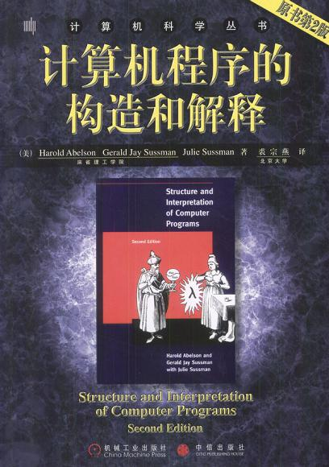
    > 我觉得视频更好，更加体现那种思想，也更容易理解
