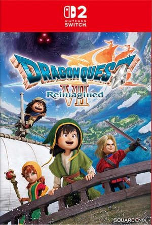
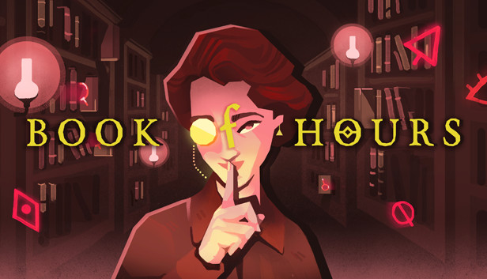
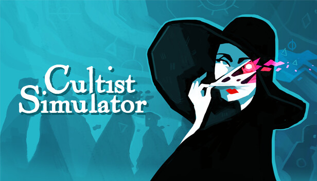

我相信遗忘, ftl的东西我几乎已经忘记了......frostpunk我还记得, 那些最好的, 记住的东西

1. FTL GDC talk 
   > 他们创作的过程是一个模拟游戏好的设计过程, 也让我看到一个好的机制设计师是什么样子, 和他们相比较，我就知道自己不是一个好的机制设计师.

2. 将游戏设计视为探索而非工作 - jonas tyroller 
   > fun, attractive, scope 游戏开发的几个关键评估标准
   >
   > 我认为深海探索的概念, 玩法原型和艺术原型区分开来的想法非常棒, 让我们可以专注在一个方面, 不被打断, 不必背负舍弃的负担
   >
   > 船长的想法也很棒, 是团队分工合作中的一环

3. 边缘世界 RimWorld 
   
   > 学! 故事模拟器!

4. 超越光速 FTL: Faster Than Light 
   

   > 学! 策略设计!

5. 勇者斗恶龙：创世小玩家2 破坏神席德与空荡岛 ドラゴンクエストビルダーズ2 破壊神シドーとからっぽの島 
   
   > 从好玩移动而来, 因为我很少想起他. 生活模拟, 如果是多人, 会更好玩

6. 勇者斗恶龙7 重制版 ドラゴンクエストVII Reimagined 
   
   > 画面很好,ui很好,手感很好, 故事也有点睛之笔, 在许多年前应该是一个好的作品，但是在今天这个讲故事的方式显得拖沓，不和谐!

7. 司辰之书 BOOK OF HOURS 
   
   > Codex 注：
   > - 把“整理图书馆、研究知识、修复藏品”做成核心循环，这个方向很少见，也很完整
   > - 它延续了同一个世界观，但明显把压力和惩罚感放低了，所以气质和密教模拟器很不一样
   > - 参考：
   >   [Weather Factory](https://weatherfactory.biz/book-of-hours/),
   >   [Steam](https://store.steampowered.com/app/1028310/BOOK_OF_HOURS/),
   >   [PC Gamer](https://www.pcgamer.com/cultist-simulator-devs-announce-book-of-hours-a-narrative-card-game-for-spooky-librarians/)

8. 密教模拟器 Cultist Simulator 
   
   > Codex 注：
   > - 它有意思的地方不只是题材，而是把“摸索规则”本身做成了体验的一部分
   > - 叙事、系统和信息隐藏绑得很紧，所以它读起来和玩起来都不像普通卡牌游戏
   > - 参考：
   >   [Weather Factory](https://weatherfactory.biz/cultist-simulator/),
   >   [Alpha and the Why](https://weatherfactory.biz/cultist-simulator-the-alpha-and-the-why/),
   >   [itch.io 采访](https://itch.io/blog/37131/the-internet-is-not-a-kind-place-for-human-brains-an-interview-with-the-masterminds-behind-cultist-simulator)
