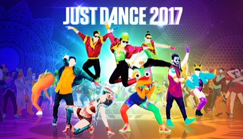
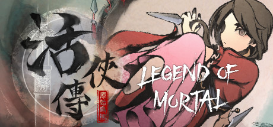

作为一个从业者，脑袋常常被屁股左右，被金钱和工作压力不知不觉地影响自己的观点。我想提醒自己，要自由地思考，在这个列表里抛开一切，只有一个标准，你只需要问你自己——你有没有感动，被拥抱的那种感动。

过去我玩过很多游戏, 有些是为了从现实中逃避出来, 大多数是和朋友们一块儿找个事儿做. 当我离开我的朋友们的时候, 那些我都不愿意再玩了。那么丢弃了那些游戏之后, 还剩下什么你喜欢的, 能完整玩下来的.

以我对自己的了解, 我是一个讲故事的人, 游戏是一种讲故事的方式. 不过在做游戏的时候, 也会很容易用一些条条框框去限制自己, 比如说我过去做过一些叙事游戏，那么我就会想, 我就适合这些, 而不适合另外一些类型, 根据我对自己的看法, 根据我对过去经历总结出的经验我会形成一套成见, 它帮助我集中精神, 也限制我的视野。但是我想如果你真的被某个东西打动了, 你感受得到它的美, 那么真实的感受应该要超越被总结出的经验, 它应当被接纳, 成为新的规则。也就是说，感受汇聚成经验，在某些时候要相信自己的感受，要超越经验，当然更要超越外界的权威和知识。

Frostpunk是8-10小时, 有一个吸引人的故事的
A Short Hike是2-3小时, 拥有一个轻松的氛围, 简单的机制, 在中午玩儿完的甜品
Dredge是8-10小时, 让我一直好奇后面还有什么神秘的东西的
这些我都很喜欢

我想再提醒自己一点。其实不仅是工作会影响我的判断，对游戏的认识也会，比如说游戏其实源自街机，所谓"正统"其实是格外强调游戏性(gameplay)的, 有时候我会太关注原创的游戏性-一个我没有才能, 也并不感兴趣的东西, 而忽略了其他可贵的事物。

每天都有许多的游戏被制造出来，然后销售。有一些游戏，你觉得它有些地方也不错，但是它没能打动你，那就不够。不够。那些还行的东西，也有些不太行，我们应该从中学习，还是避开他们呢？我不知道，我们需要读得更多，把更多的时间放在事物上，这样就不用用一些简单的方法和原则来节约时间。

关键词：叙事驱动，体验引擎，人文, 策略选择, 探索, casual, 简洁, 生活, 新颖,
负面关键词：非战斗,非反应,非计算, 非高度重复

------

1.弗洛伦斯 Florence 

看到[鸭鸭侦探 Duck Detective](./好看)让我理解了为什么Florence是一个非常好的游戏。
Florence和duck在抽象的游戏结构上是相仿的，收集-推进，也可以叫拼图结构（去完成一些事情，然后推进到下一个场景），但florence从来不是重复地，一次又一次地点击显而易见的目标，它的谜题，需要玩家做出的动作和游戏情景高度融合，和生活相呼应并激发产生对应的情感。
duck的幽默和轻松体现在对话的句子和美术风格上，但你一旦开始玩就会发现这个世界非常单调——它需要玩家实现的目标，它允许玩家在这个世界进行的动作非常重复。他的幽默过于浅显过于刻意，以至于人们感觉是在挑逗，也缺乏由头，这样一个故事就更难让人进行下去了。

如果让我去描述这个游戏的组织结构，我会说它是一个由谜题、由这种互动玩具组织起来的一段旅途，它融合在故事里，非常完美地讲述了一段故事。它最有趣的地方在于，这个故事贴近人们日常生活的故事，它本身就很好地调动人们的情感，而这个互动形式本身也能够激发人们的情感。

从产品的角度来看，那么它是一个非常有趣，有感情的互动产品。如果你完全从一个故事的角度去看它，你从一些文学或者各种各样的角度去看，那么我们很难说它在文学性上面有什么探索和突破。

2.冰汽时代 Frostpunk 

充满紧张，但是又触动人心
游戏设计学习的目标之一

3.短途旅行 A Short Hike 

探索, 温馨, 一个简单但有趣的机制和成长把一切串联起来, 有意思
游戏设计学习的目标之一

4.渔帆暗涌 DREDGE 

游戏设计学习的目标之一

探索, 冒险, 发现. 
其实这个游戏底层有一个跟打怪升级同样结构的机制。你想要改造自己的船只，需要更多的零件、更昂贵的钱，而这些需要去到更深的海、更独特的海域。这一设计能够引导玩家去探险体验新的内容。所以这是游戏的底层的一种经济结构，它为资源，成长，探索提供了经济支撑。
人们喜欢设计属于自己的东西，然后去和这个世界互动。当你在游戏中选择一个职业，搭配技能去战斗的时候如此。在这条船上按你自己喜欢的方式去组装和升级这条船，然后去面对世界也是如此。

这个游戏最初的和最重要的驱动力来自于神秘，探索，并和这个世界互动，你不知道深海里有什么，你不知道远方有什么。于是你储蓄，成长，扬帆起航。你发现一个小岛上有画家，你发现远方的一个岛屿里有巨大的鲨鱼，你发现在山谷里面有奇怪的鱼类。还有什么呢？你会问自己。

5.深空梦里人2 Citizen Sleeper 2: Starward Vector 

好玩
游戏设计学习的目标之一。

6.孤星寂海 In Other Waters 

好玩, 不是那种强烈牵引着你, 让你心跳加速欲罢不能的东西. 它安静, 和谐, 优雅, 引人深入, 让人回味. 我以为它会把流程做长, 我看着那个47%的进度, 已经有些厌烦的时候它正好结束了, 很好, 不多也不少。

7.桌游设计指南 

游戏书籍里我读过最有用的书，其他书里讲到的丰富的细节后来我都忘了，这本书我却常常想起来。

8.体验引擎 

9.越过阿尔卑斯山 Over the Alps 

精致的互动绘本, 文本的互动性很强, 给我的代入感最强的文字互动. 虽然玩第二个故事会觉得有点无聊(其实第二个更加抓人, 更戏剧化)

10.孤山速降 Lonely Mountains: Downhill 

喜欢他的探索，casual感，一点技巧，不喜欢挑战。我更希望他能变成短途旅行那样的，趣味，探索。
<孤山独影>是我应该去玩的一个游戏, 我觉得我会喜欢

11.肯塔基零号国道 Kentucky Route Zero 

并不是特别喜爱的游戏，但是它和roki，oxenfree一起，让我看到游戏的可能性, 拓宽了游戏设计的边界
有些游戏需要你坐下来，安静下来和他交流。

12.舒林 Cozy Grove 

系统简单流畅的生活模拟, 我喜欢他的系统流畅和谐, 不喜欢它的重复.
如果是多人就好了, 或者如果是一段简单的旅途就好了.
https://www.jank.cool/i-want-to-discover-new-worlds-subnautica-2/ 这篇文章里面列举了许多关于探索和发现的事情。在 Cozy Grove 里面，探索和发现新的东西其实很有趣，但是一旦第二天重复，或者开始经营建设，事情就变得无聊了。应该这么说，这个游戏一开始是探索和发现, 简单的点击在这个世界中也会带来很多的可能性。然而，在完成一次任务之后，这个东西就不再具有探索的乐趣了，它变成了一个手段——为了你的露营，建立一个你自己的家，去养育一些什么一个更高目标的一部分，对我来说，建造养育不是我感兴趣的，所以说，玩了几天之后，我就对他失去了兴趣。

包括在孤山速降里，我觉得挑战有些太大了，但是它的探索和环境氛围仍然让人享受。孤山独影那个攀登游戏，它是一个技巧游戏，但探索的成分也很多。
subnautica以及 outer world 也被视作这种游戏，但是对我来说，不知道是因为3D还是那种自由自在的探索，缺乏目标感，我总是没办法沉浸进去。

13.奥森弗里2：信号丢失 OXENFREE II: Lost Signals 

我以为我不喜欢他, 但我常常想起它, 它在构筑游戏世界时候的那些谈话, 那些闲言碎语。

14.节奏光剑 Beat Saber 

15.Just Dance 

16.文明6 Sid Meier's Civilization VI 

它多样的策略是同类型游戏里面的佼佼者，而且更重要的是，它的策略形成了许多故事。
我和朋友在一起玩过很久，一个人的时候我就不会玩它。

17.活侠传 Legend of Mortal 

开发者访谈：https://game.udn.com/game/story/122090/8114531

这个游戏很有意思，它并不复杂，但是你能看得出来剧情，人物你能够记得住，时间管理和行动结果也是认真，是用心的。不同的路线和可能性也让你再走一条路的时候不禁发问，roll到另外一个点会怎么样？战斗时也是也挺有意思的，不是简单的那种数值堆叠。也不复杂。画面也是并不复杂，但还是有一些趣味的。
这是一部相当有趣的作品。机制清晰，战斗为了游戏服务。而且还出现了两种战斗，但是也没问题，你可以把它们都看作为这个，为人物成长的一种小游戏，它并不是游戏乐趣的核心。
然而在我玩到第8个月还是第9个月的时候，游戏就变得有些无聊了，因为行动集合没有。变大。战斗呢，它的成长变成了数值性的成长，没有带来太多的新鲜的感觉。人物故事呢，刚开始会觉得比较新鲜，但当你经历了一些时候，就会觉得无聊。不过到了这个时候已经没什么太多策略选择，你很忙碌，但是你的行动开始越来越盲目了，你是为了目的而积累，而不是本身的乐趣，你开始上班了。（我觉得这里有奇怪的一个地方在于，它到后面其实开始机械了。但是正是因为它简单的操作就能把游戏向前推进，而不是其他的那种复杂的，但是很枯燥的战斗，反而会让你继续玩下去。）
这个游戏到了后面，驱动力是什么呢？更多的武功，你好奇它是什么？人物，你好奇和他们的关系推进会有什么样的变化？剧情，你好奇这样一个丑八怪是如何成为一个大侠的？这些仍然是非常有目标感和驱动力的，驱使着你继续玩下去。不是数值，不是玩法在驱使着你玩下去，而是它所构成的这种选择的权利，你的选择路线在驱动着你，这个故事在驱动着你前进。我们可以说，这种玩法和养成并不是它的核心驱动力，故事才是。[^1]

一个足以证明这件事情的是，在我看剧透，了解到大师兄会死的时候，学医术可以救他，但是医术又是一个在战斗中无用的技能，所以为了故事中的一个人，我会放弃战斗，这就是我觉得他故事成功的证明。

虽然我不喜欢，我觉得后面重复太多，但是我必须承认的是，如果你想做一个长线，那么这种方式其实是一种可以学习的方法。基础的运转系统已经建立，在这之后就是重复的循环，随着对手的强大，数值的提高，技能的增多，他们会不断要求你这些数值提高，如此反复，循环，直到终点。你也可以说它是一种省力的办法，这样他们就可以把时间花在人物的塑造上面。
它不像Citizen Sleeper 2那样，随着游戏的进展，你会发现这个世界越来越多的东西。而且它在这种交锋或者是城市生活的模拟上面，始终在给你带来新的东西。它对故事的叙述以及这种内容的设计是非常出色的。如果说活侠传是一种有趣的水平的话，那么Citizen Sleeper 2，我认为是非常出色的水平。
但我仍然可以从中学到很多东西，经济结构的设计，一些小的想法，一些人物的设计。有时候恰恰是因为它简单，才更适合学习。

另一个值得去思考和学习的地方就是如何在游戏循环中呈现出人物以及牵动玩家的感情。在Frost Punk里面我们能看到，在俄勒冈之旅中我们也能看到，在活侠传中我们也能看到。其实在其他的游戏中也能看到，比如Paper Please

