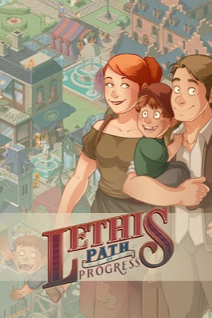
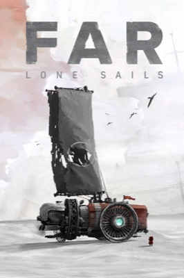
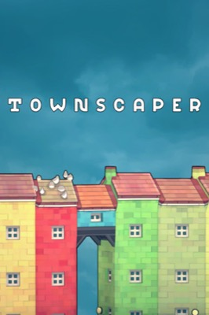
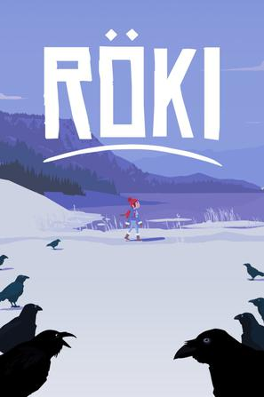
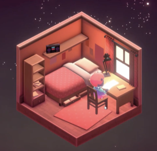
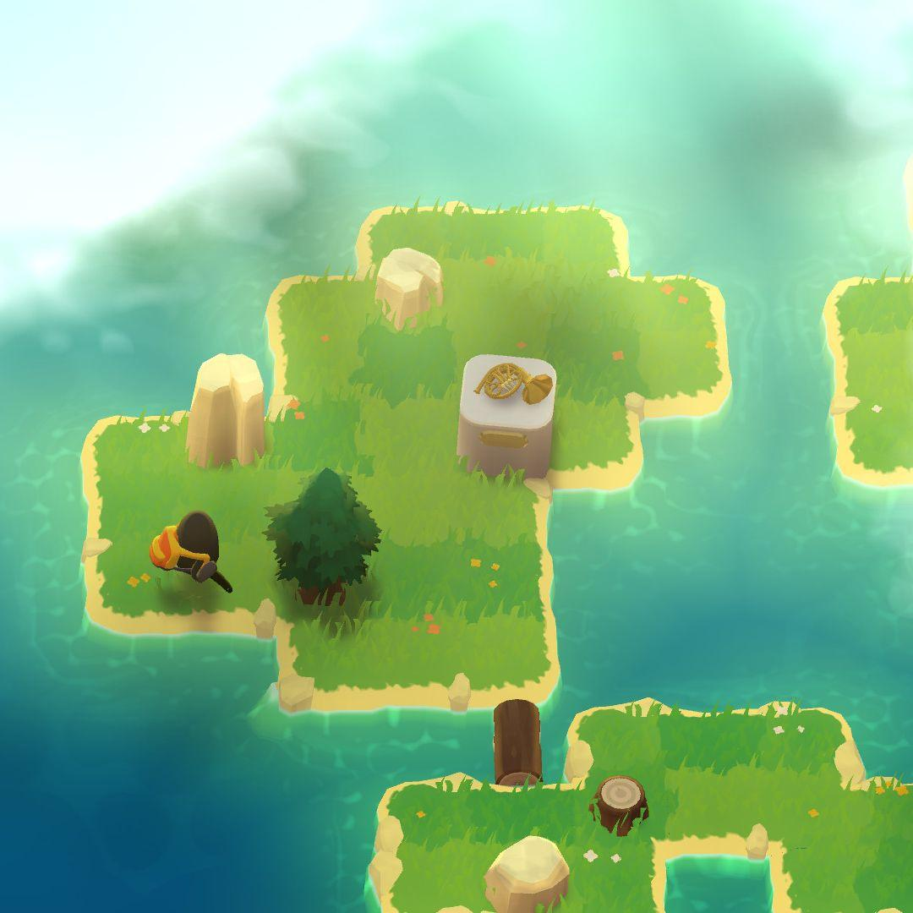
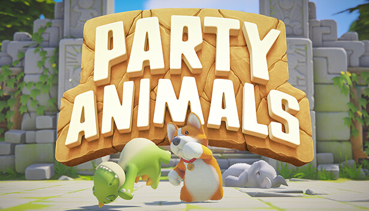
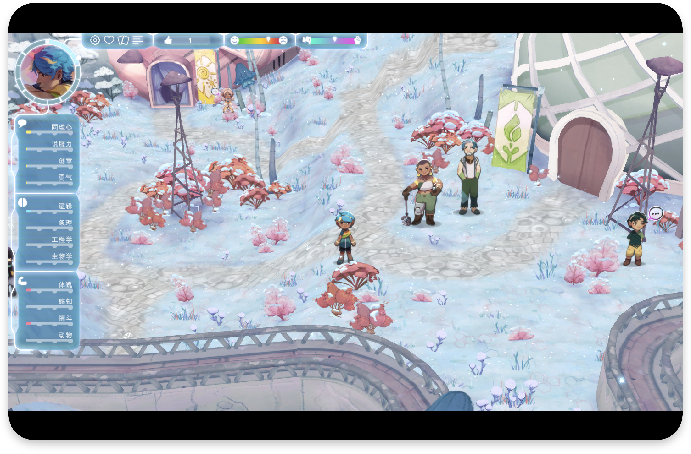

我不一定玩, 许多都不玩, 但是好看。

但今天我看到两个游戏，按照我的品味，AI给它们打了四分。但当我看的时候，我第一眼就找它的图片，去直观地了解这个游戏长什么样子，它的玩法是什么样。当画面表现得脏或者乱的时候，我就完全失去兴趣，不再看下去了。我觉得对于游戏来说也有一个边界。我不会画画，也不会建模，我对于画面没有太多追求，但我的底线在于，它们应该是简洁、有质感、能让人感觉到和谐和舒适的，能让人愿意了解其他部分。下面列举的游戏，许多都是一两个人完成的作品，但他们的画面仍然表现出很高的水准，我需要从中学习。
我觉得有一个基准， RimWorld，它的人物很简单，很符号化。但如果你仔细去看，它通过一些shader和程序化，整个世界是有阴影的，草和树有这种热气的弯曲效果，人物是有反馈的，它的按钮是有这种边框的，有许多细节。

我认为游戏形式截图也直观反映了游戏的玩法。你看到棋盘和格子战斗，你却知道它是一个棋盘游戏，需要复杂的计算的。

1.短途旅行 A Short Hike 

2.王权陨落 Thronefall 

3.怒猿逃生 APE OUT 

4.迈阿密热线 Hotline Miami 

5.黑色起源 Genesis Noir 

6.Amberspire 

画风很温暖, 很干净, 平静

7.LETHIS：进步之路 Lethis: Path of Progress 

城市自己运转和成长有一个规则，在以繁荣的微缩世界为目标之下，不断忙碌，被捕获注意力，并享受这个结果——繁荣的城市。
虽然我很欣赏这种游戏的简洁，规则性，给玩家自由设计的权利。但我想它的忙碌和目标都不是我喜欢的，我从来没有真正完成过这一类游戏，但是这个游戏的模式衍生出来冰汽时代是我喜欢的。

8.FAR: Lone Sails 

这是一个很有禅意的游戏。但在旅行的过程中，它的操作让人感到无聊。我觉得原因是它的操作需要精准性，同时又有很多不确定性。感觉像是一直在开一辆随时出问题的车，而不是在开车。你会把一部分心思放在开车上。当你越来越熟练，你就会把更多的注意力放在周围的世界和风景上。这一点可以参考 In Other Waters（孤星寂海），它做得更好。

9.鸭鸭侦探 Duck Detective 

画面清新明媚，经典的点击-收集线索-推进故事

10.肯塔基零号国道 Kentucky Route Zero 

11.Townscaper 

能让你很轻松地，很漂亮地设计你想要的房子。后来有一个我忘了什么名字的游戏，它增加了一个规则：每一关，主要建筑有自己的需求，空调、灯光、绿植等等，你需要满足住户的需求才能前往下一关，所有这些你的努力最终揭晓一个岛屿——你不懈的努力设计了这一切。
增加了评分——其中的人们如何评价它（就像模拟城市和模拟人生那样），融入了一个关卡式的进程设计，这样就有了规则和目标。
如果说 Townscaper 是一个随心所欲的房子或者人偶，后来孩子们自己为它添加了规则，社会关系，从一个人偶玩具变成了一场具有目的和仪式的过家家。
《我的世界》和《勇者斗恶龙建造者》的关系也类似如此。

12.洛基：北欧怪奇之旅 Röki 

怪兽aho！语音很好，画面定格很好

13.Kind Words 

很安静，很温柔。一个只靠文字、声音和氛围就能把人留住的交互游戏。

14.怪兽远征 A Monster's Expedition 

如果当时我们《色彩物语》能够达到这样的画面触感，有一种宁静但生机盎然的感觉就好了。
特别是它的缩小和拉大的感觉很好，东西的触感也很好。
当然，解谜游戏对我来说太难了，我不玩儿这个。

15.动物派对 Party Animals 

我不玩儿这个游戏，但是人物和动作真的很可爱，毛绒绒的质感，有点像迪士尼消消乐的球

16.I Was a Teenage Exocolonist 

非常有生活模拟的感觉，这正是我们之前在做《色彩物语》的时候所缺乏的。这个游戏有一个成长并不断加入你的记忆，然后你的记忆又去完成一些挑战的玩法规则。这个东西还是挺有意思的。
不过我得告诉我自己，这个游戏我玩不下去，我最好也不要做和它玩法感觉相似的游戏。